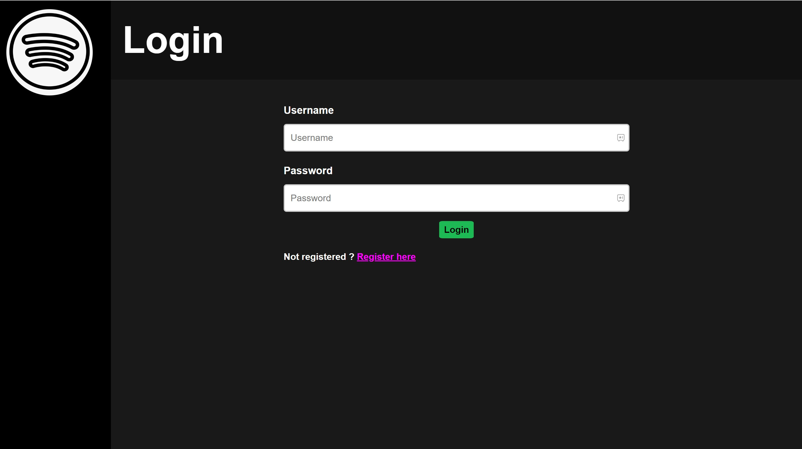
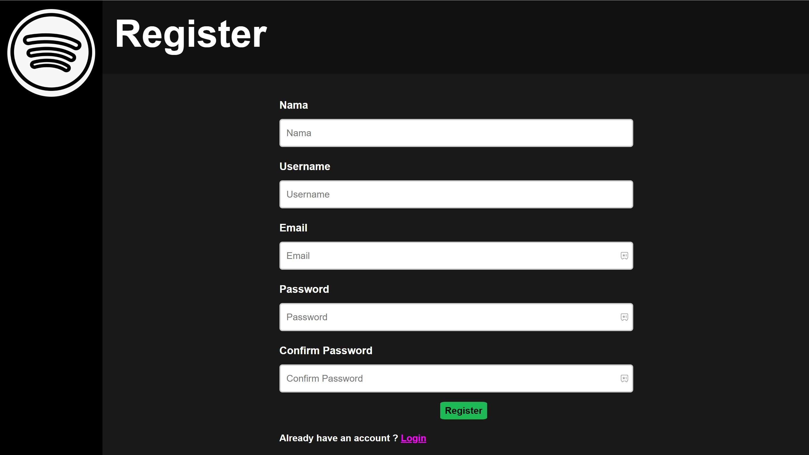
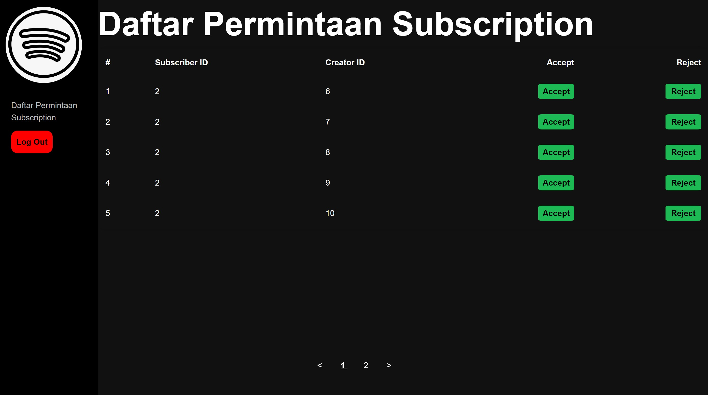
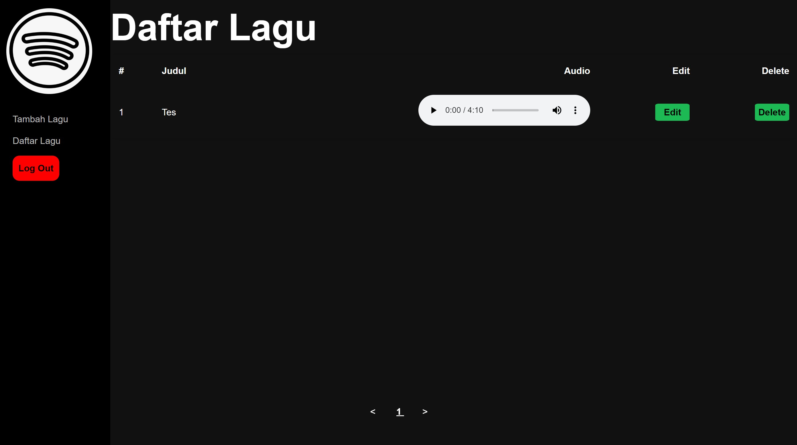
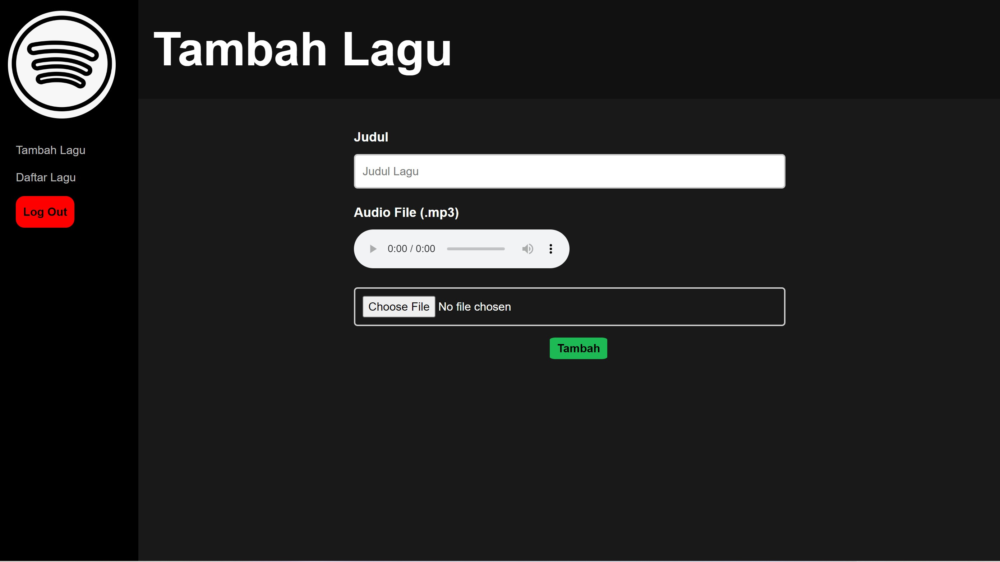

# Tugas Besar 2 IF3110 - HaBeDe - Binotify Premium App
## Deskripsi Aplikasi

Aplikasi web yang dibuat merupakan sebuah aplikasi premium dari Binotify, yaitu aplikasi streaming musik. Pengguna dari aplikasi dibagi menjadi 2, *admin* dan *penyanyi*. *Admin* dapat melakukan *accept* atau *reject* dari permintaan *subscription* yang didapat dari aplikasi Binotify. *Penyanyi* dapat menambah, menghapus, mengubah, dan melihat detail lagu oleh penyanyi tersebut.

## *Sreenshot* Tampilan Aplikasi

### Login
 

### Register
 

### Halaman Permintaan Subscription
 

### Halaman Pengelolaan Lagu
 
 
 

## Pembagian Tugas
* Frontend & Backend Login: `13520160` 
* Frontend & Backend Register: `13520160` 
* Frontend Halaman Permintaan Subscription: `13520133, 13520160` 
* Backend Halaman Permintaan Subscription: `13520154, 13520160` 
* Frontend Halaman Pengelolaan Lagu: `13520133, 13520160` 
* Backend Halaman Pengelolaan Lagu: `13520154, 13520160` 